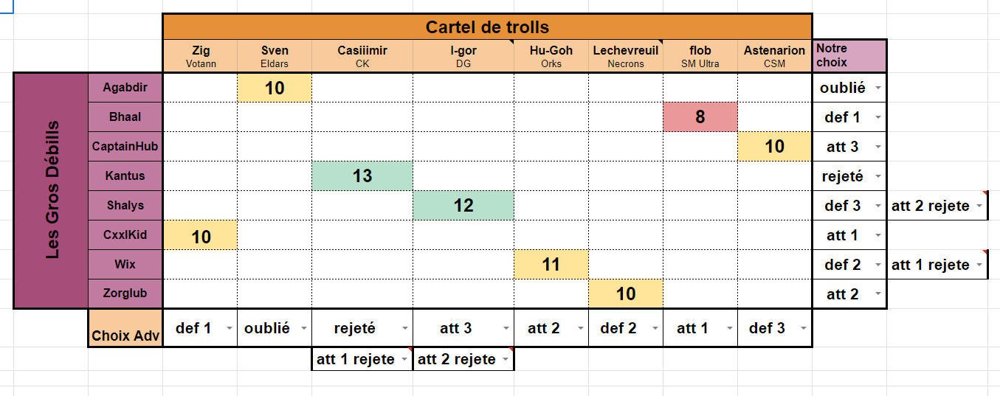

# Générateur de Pairings pour Warhammer (8 contre 8)

Ce projet vise à être utilisé pour générer les meilleurs pairings possibles dans le cadre de match en équipe de Warhammer (8 contre 8) afin de réduire les possibilités de 8!^2 à seulement une dizaine d'arbres de probabilités maximum.

Le programme affichera une interface graphique sous forme d'un tableau de 8 par 8 (avec une ligne supplémentaire pour indiquer les joueurs et leurs factions).

Voir exemple de tableau :

(Tableau de pairing )[./pairing_complet.png]

Vous pourrez y entrer les estimations des joueurs par joueur.

L'utilisateur pourra remplir ce tableau manuellement ou charger des configurations existantes. Ensuite, le programme générera une liste des 10 meilleures possibilités de pairings pour aider l'utilisateur dans son choix.

## Règles

Il y a 8 rôles possibles et uniques, et chaque joueur doit en avoir un à la fin du traitement :

- Défenseur1
- Attaquant1
- Défenseur2
- Attaquant2
- Défenseur3
- Attaquant3
- Rejeté
- Oublié

Le système de pairing fonctionne comme suit :

1. Chaque équipe choisit en premier lieu un de ses 8 joueurs comme Défenseur1.

2. Ensuite, chaque équipe envoie 2 joueurs en tant qu'Attaquant1, et l'équipe adverse en retient seulement 1 des deux. Ce joueur devient l'adversaire du Défenseur1.

3. Chaque équipe aura donc un joueur en défense qui aura un match contre l'attaquant de l'équipe adverse et un joueur en attaque qui aura un match contre la défense de l'équipe adverse.

4. On répète le processus en envoyant un Défenseur2 parmi les 6 joueurs restants de chaque équipe.

5. Ensuite, chaque équipe envoie 2 joueurs parmi les 5 restants en tant qu'Attaquant2. Chaque équipe peut choisir l'adversaire et rejeter l'autre.

6. Il restera alors seulement 4 joueurs par équipe. On répète le processus de défense/attaquant une dernière fois.

7. Chaque équipe envoie un joueur parmi les 4 restants en tant que Défenseur3 et enverra 2 joueurs parmi les 3 restants en tant qu'Attaquant3.

8. Il y a un rôle de Rejeté et d'Oublié. Le joueur non retenu comme Attaquant3 sera le joueur Rejeté et se battra contre le joueur Rejeté par l'équipe adverse. Les 2 joueurs restants seront les Oubliés et se battront ensemble.

## Système de Score

Chaque match aura un score sur 20, calculé en fonction des estimations du tableau (l'adversaire aura le score inverse).

L'objectif est d'obtenir le meilleur score global en additionnant les scores de tous les matchs de l'équipe 1. Le score global sur 8 matchs ne peut pas dépasser 160 (20 * 8), avec les résultats possibles suivants :

- Si le score de l'équipe 1 est < 75, c'est une défaite.
- Si le score de l'équipe 1 est < 85 mais > 75, c'est une égalité.
- Si le score de l'équipe 1 est > 85, c'est une victoire (l'objectif visé).

Dans l'exemple suivant :

## Technologies utilisées

Le projet sera développé en C# et utilisera WPF UI. De plus, il fera appel à une API AWS (à préciser).
