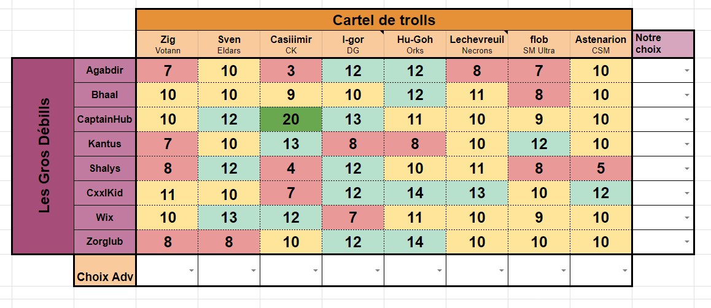

# Générateur de Pairings pour Warhammer (8 contre 8)

Ce projet vise à être utilisé pour générer les meilleurs pairings possibles dans le cadre de match en équipe de Warhammer (8 contre 8) afin de réduire les possibilités de 8!^2 à seulement une dizaine d'arbres de probabilités maximum.

Le programme affichera une interface graphique sous forme d'un tableau de 8 par 8 (avec une ligne supplémentaire pour indiquer les joueurs et leurs factions).

Voir exemple de tableau :

Vous pourrez y entrer les estimations des joueurs par joueur.

L'utilisateur pourra remplir ce tableau manuellement ou charger des configurations existantes. Ensuite, le programme générera une liste des 10 meilleures possibilités de pairings pour aider l'utilisateur dans son choix.

## Règles

Il y a 8 rôles possibles et uniques, et chaque joueur doit en avoir un à la fin du traitement :

- Défenseur1
- Attaquant1
- Défenseur2
- Attaquant2
- Défenseur3
- Attaquant3
- Rejeté
- Oublié

Le système de pairing fonctionne comme suit :

1. Chaque équipe choisit en premier lieu un de ses 8 joueurs comme Défenseur1.

2. Ensuite, chaque équipe envoie 2 joueurs en tant qu'Attaquant1, et l'équipe adverse en retient seulement 1 des deux. Ce joueur devient l'adversaire du Défenseur1.

3. Chaque équipe aura donc un joueur en défense qui aura un match contre l'attaquant de l'équipe adverse et un joueur en attaque qui aura un match contre la défense de l'équipe adverse.

4. On répète le processus en envoyant un Défenseur2 parmi les 6 joueurs restants de chaque équipe.

5. Ensuite, chaque équipe envoie 2 joueurs parmi les 5 restants en tant qu'Attaquant2. Chaque équipe peut choisir l'adversaire et rejeter l'autre.

6. Il restera alors seulement 4 joueurs par équipe. On répète le processus de défense/attaquant une dernière fois.

7. Chaque équipe envoie un joueur parmi les 4 restants en tant que Défenseur3 et enverra 2 joueurs parmi les 3 restants en tant qu'Attaquant3.

8. Il y a un rôle de Rejeté et d'Oublié. Le joueur non retenu comme Attaquant3 sera le joueur Rejeté et se battra contre le joueur Rejeté par l'équipe adverse. Les 2 joueurs restants seront les Oubliés et se battront ensemble.

## Système de Score

Chaque match aura un score sur 20, calculé en fonction des estimations du tableau (l'adversaire aura le score inverse).

Exemple si le Défenseur1 de l'équipe 1 a un score estimé a 8 contre l'attaquant1 de l'équipe 2 dans le tableau alors l'attaquant de l'équipe 2 aura un score de 20 - 8 (le score du défenseur de l'équipe 1) donc 12 

L'objectif est d'obtenir le meilleur score global en additionnant les scores de tous les matchs de l'équipe 1. Le score global sur 8 matchs ne peut pas dépasser 160 (20 * 8), avec les résultats possibles suivants :

- Si le score de l'équipe 1 est < 75, c'est une défaite.
- Si le score de l'équipe 1 est < 85 mais > 75, c'est une égalité.
- Si le score de l'équipe 1 est > 85, c'est une victoire (l'objectif visé).

Dans l'exemple suivant :

L'équipe 1 (Les Gros Débills) auront donc

Agabdir en tant que Oublié et il fera un match contre Sven qui sera l'Oublié de l'équipe 2 dans lequel le score sera de 10 a 10 
Bhaal en tant que Défenseur1 et il fera un match contre flob qui sera l'Attaquant1 de l'équipe 2 dans lequel le score sera de 8 a 12
CaptainHub en tant que Attaquant3 et il fera un match contre Astenarion qui sera le Défenseur3 de l'équipe 2 dans lequel le score sera de 10 a 10
Kantus en tant que Rejeté et il fera un match contre Casiimir qui sera le Rejeté de l'équipe 2 dans lequel le score sera de 13 a 7
Shalys en tant que Défenseur3 et il fera un match contre I-gor qui sera l'Attaquant3 de l'équipe 2 dans lequel le score sera de 12 a 8
CxxlKid en tant que Attaquant1 et il fera un match contre Zig qui sera le Defenseur1 de l'équipe 2 dans lequel le score sera de 10 a 10
Wix en tant que Défenseur2 et il fera un match contre Hu-Goh qui sera l'Attaquant2 de l'équipe 2 dans lequel le score sera de 11 a 9
Zorglub en tant que Attaquant2 et il fera un match contre LeChevreuil qui sera le Défenseur2 de l'équipe 2 dans lequel le score sera de 10 a 10

On aura alors 10+8+10+13+12+10+11+10 = 84 de score pour l'équipe 1

et par définition 160-84 = 76 de score pour l'équipe 2

Donc ce pairing mêne a une égalité

## Technologies utilisées

Le projet sera développé en C# et utilisera WPF UI. De plus, il fera appel à une API AWS (à préciser).
